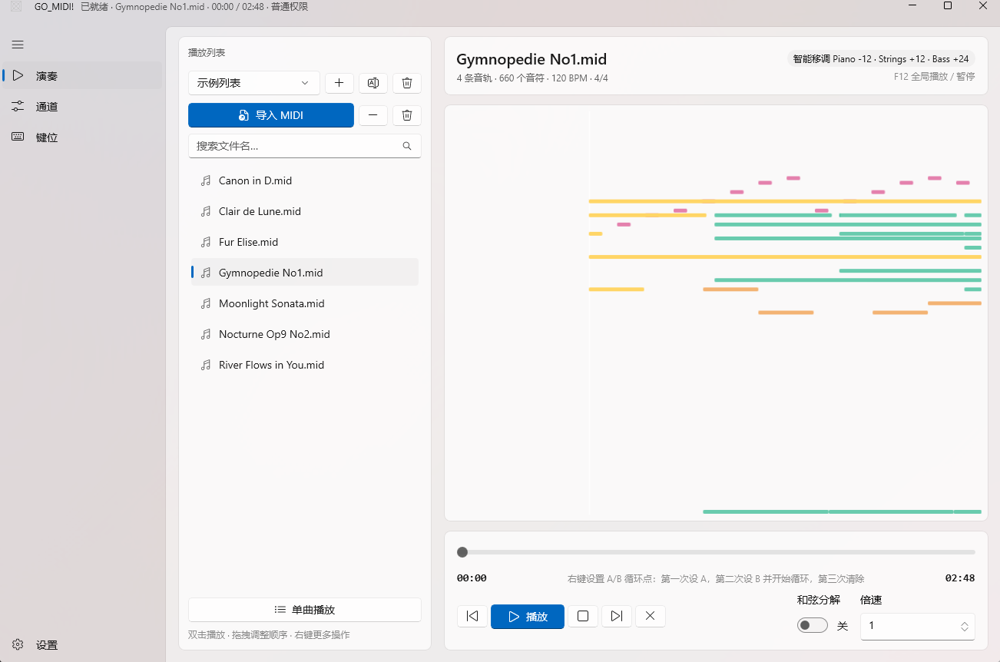
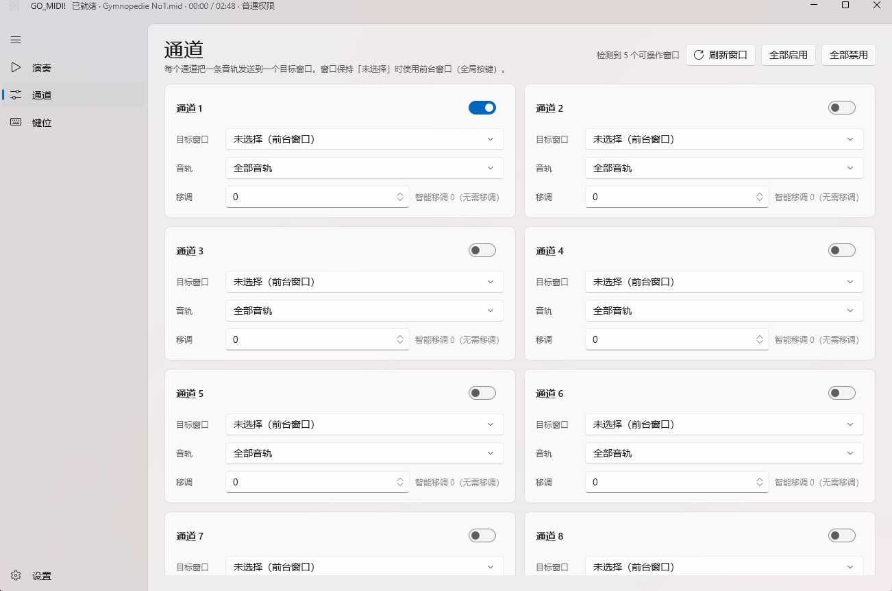
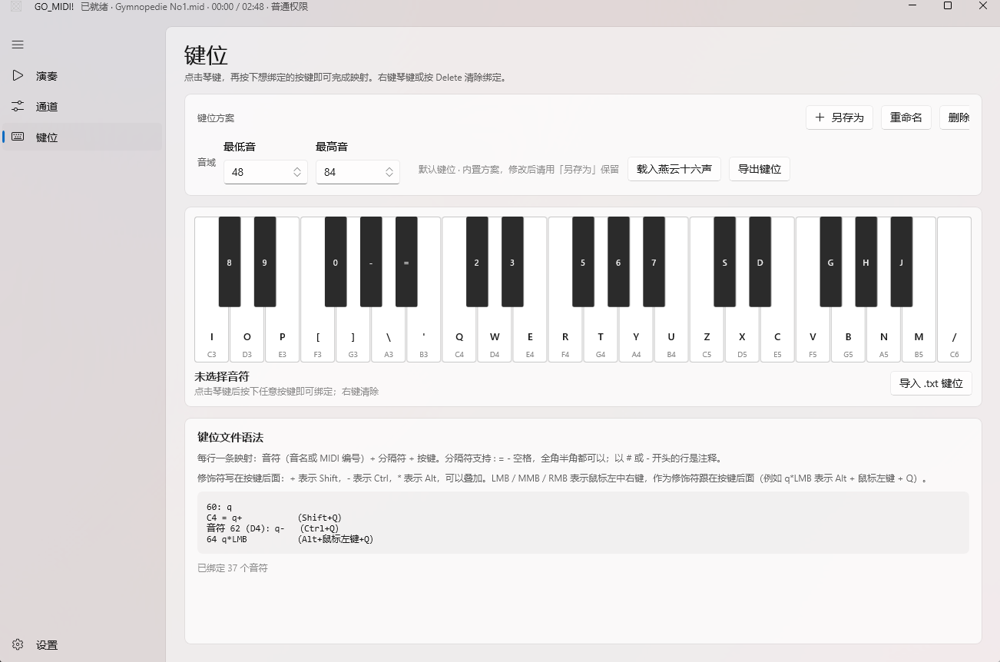
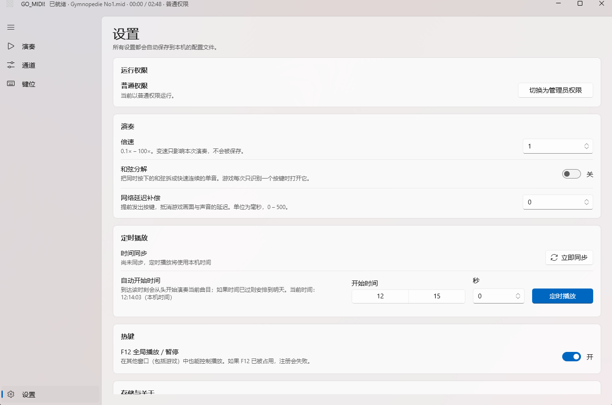

# GO_MIDI! · WinUI 版

[qr-rp/GO_Midi](https://github.com/qr-rp/GO_Midi)（C++ / wxWidgets）的 **WinUI 3 + C# 重写版**。

把 MIDI 文件解析成键盘按键，发送给游戏窗口实现自动演奏。原版功能全部保留，
界面换成 Fluent Design：Mica 材质、卡片布局、跟随系统的浅色 / 深色主题，
以及三个自绘控件（钢琴卷帘、A/B 循环进度条、键位键盘）。

免安装：解压即用，不需要安装包、不需要注册表、不需要预装 .NET 或 Windows App SDK。



---

## 目录

- [功能](#功能)
- [界面](#界面)
- [快速开始](#快速开始)
- [播放模式](#播放模式)
- [AB 点循环](#ab-点循环)
- [媒体键](#媒体键)
- [定时播放](#定时播放)
- [键位文件格式](#键位文件格式)
- [运行权限](#运行权限)
- [配置文件](#配置文件)
- [从源码构建](#从源码构建)
- [项目结构](#项目结构)
- [相对原版的改动](#相对原版的改动)
- [已知限制](#已知限制)
- [致谢与许可](#致谢与许可)

---

## 功能

| 功能 | 说明 |
| --- | --- |
| MIDI 解析 | Format 0 / 1，完整节拍图（变速曲目按秒对齐），支持 SMPTE 时间基准 |
| 多通道 | 8 个独立通道，每个可配置目标窗口 / 音轨 / 移调 / 启用 |
| 智能移调 | 按音高直方图自动计算最佳移调，优先保证音符能落到键位上 |
| 键盘模拟 | `SendInput`（前台窗口）与 `PostMessage`（指定窗口）双路径 |
| 键位方案 | 内置 FF14 与燕云十六声，支持 `.txt` 导入导出与可视化编辑 |
| 播放列表 | 多列表、拖拽排序、搜索、批量导入、5 种播放模式 |
| AB 点循环 | 进度条右键设点、拖动调整、第三次右键清除 |
| 定时播放 | NTP 时间同步 + 倒计时，到点自动开始 |
| 媒体键 | 系统媒体会话：上一首 / 下一首 / 播放暂停 / 停止 |
| 全局热键 | F12 播放 / 暂停 |
| 和弦分解 | 把同时按下的和弦拆成快速连续的单音 |
| 延迟补偿 | 提前发键，抵消画面与声音延迟 |

---

## 界面

| 通道 | 键位 |
| --- | --- |
|  |  |

| 设置 |
| --- |
|  |

---

## 快速开始

1. 到 Releases 页面下载 `GO_MIDI-WinUI-x64.zip`，解压后双击 **`GoMidi.exe`**。
2. 「键位」页确认键位方案与音域和游戏一致（FF14 为 48–84，燕云十六声为 48–83）。
3. 「演奏」页点「导入 MIDI」，或直接把 `.mid` / `.midi` 拖进窗口。
4. 「通道」页把「通道 1」的目标窗口设为游戏窗口（保持「未选择」则发给前台窗口）。
5. 回「演奏」页双击曲目或点「播放」，用 **F12** 随时暂停 / 继续。

> **游戏以管理员身份运行？** 那么本程序也需要以管理员身份运行，
> 否则 Windows 会静默丢弃发出的按键。见 [运行权限](#运行权限)。

---

## 播放模式

点播放列表下方的模式按钮循环切换：

| 模式 | 一曲结束后的行为 |
| --- | --- |
| 单曲播放 | 停在末尾 |
| 单曲循环 | 从头再放一遍 |
| 列表播放 | 播下一首，到列表末尾停止 |
| 列表循环 | 播下一首，到末尾回到第一首 |
| 随机播放 | 随机顺序播放完整一轮后重新洗牌 |

---

## AB 点循环

在进度条上**右键**：

1. 第一次 —— 设置 **A** 点（绿色标记）。
2. 第二次 —— 设置 **B** 点（红色标记），区间高亮，并自动跳到 A 点开始循环。
3. 第三次 —— 清除 A/B 点，退出循环。

右键**按住** A 或 B 标记可拖动调整（A 始终保持在 B 之前）。
左键拖动进度条定位，松开即播放。

---

## 媒体键

程序会注册为 Windows 媒体会话（SMTC），因此**键盘上的媒体键**可以直接控制播放：

| 媒体键 | 行为 |
| --- | --- |
| 上一首 | 上一曲 |
| 下一首 | 下一曲 |
| 播放 / 暂停 | 播放或暂停 |
| 停止 | 停止 |

系统媒体弹窗（按音量键时弹出的那个）会显示当前曲目名，并可直接操作。

> 媒体键由系统按「当前活动会话」转发，所以**只有在有曲目已加载时**才会路由到本程序；
> 没加载曲目时不会抢占其他播放器的媒体键。同理，「停止」在未播放状态下不会被转发，
> 这是 Windows 自身的行为。

---

## 定时播放

「设置 → 定时播放」：

1. 点「立即同步」获取网络时间。依次尝试 `ntp.aliyun.com`、`cn.pool.ntp.org`、
   `time.windows.com`、`pool.ntp.org`。
2. 选择开始时间与秒数，点「定时播放」。
3. 页面与标题栏显示倒计时，到点后**从头开始**演奏当前曲目。

未同步时使用本机时间，仍然可用。网络延迟补偿会提前相应毫秒触发以抵消输出延迟。

---

## 键位文件格式

每行一条映射：**音符 + 分隔符 + 按键**。

```
# 以 # 或 - 开头的行是注释
60: q              音符用 MIDI 编号
C4 = q             音符用音名
音符 62 (D4)：q-   带备注，全角冒号也可以
64　v              全角空格分隔
```

| 项目 | 支持写法 |
| --- | --- |
| 音符 | MIDI 编号 `60`，或音名 `C4` `C#4` `Db4`（C4 = 60） |
| 分隔符 | `:` `=` `-` 空格，以及全角 `：` `＝` `－` `　` |
| 按键 | `a`–`z`、`0`–`9`、`[` `]` `\` `'` `-` `=` `/` `,` `.` `;` 以及反引号 |
| 修饰符 | 写在按键**后面**，可叠加：`+` = Shift，`-` = Ctrl，`*` = Alt |
| 鼠标键 | `LMB` / `MMB` / `RMB` 作为修饰符跟在按键后，例如 `q*LMB` = Alt + 鼠标左键 + Q |

文件编码自动识别：UTF-8（含 BOM）、GBK / GB2312、Big5、Shift-JIS、Windows-1252、ISO-8859-1。

内置方案：

- **默认键位**：FF14 演奏键位，48–84（C3–C6）全 37 个半音，无修饰键。
- **燕云十六声**：48–83（C3–B5）36 键，升音使用 Shift / Ctrl 组合。

---

## 运行权限

「设置 → 运行权限」显示当前权限并可一键切换：

| 状态 | 说明 |
| --- | --- |
| 普通权限 | 默认。目标程序若以管理员运行，Windows 会拦截本程序发出的按键 |
| 管理员权限 | 可以向下游程序发送按键，包括以管理员身份运行的游戏 |

点「切换为管理员权限」会弹出 UAC 并在新实例中重启；「切换为普通权限」通过
Explorer 启动新实例（Windows 没有直接的降权 API，这是可靠做法）。
切换前会自动保存设置。

标题栏也会常驻显示当前权限（`· 普通权限` / `· 管理员`）。

---

## 配置文件

全部保存在 **`%LOCALAPPDATA%\GoMidi\`**：

| 文件 | 内容 |
| --- | --- |
| `config.json` | 通道配置、音域、键位方案、播放列表、播放模式、窗口尺寸 |
| `logs\gomidi.log` | 运行日志（超过 512 KB 轮转） |

设置改动会自动去抖保存，关闭窗口时再写一次。
「设置 → 存储与关于」可直接打开这两个目录。

---

## 从源码构建

### 前置要求

| 要求 | 版本 |
| --- | --- |
| Windows | 10 1809 (17763) 或更高 |
| .NET SDK | 10.0 |
| 开发者模式 | 构建未打包应用时需要 |

### 开发构建

```powershell
cd GoMidi
dotnet build -c Debug -p:Platform=x64
```

### 生成便携包

```powershell
.\publish.ps1
```

输出到 `GoMidi\dist\`：

```
dist\GO_MIDI-WinUI-x64\        解压即用的完整目录
dist\GO_MIDI-WinUI-x64.zip     可直接分发的压缩包（约 67 MB）
```

脚本会发布自包含版本（自带 .NET 运行时与 Windows App SDK），删除 `.pdb`，
写入 `使用说明.txt` 并打包。ARM64：`.\publish.ps1 -Platform ARM64`。

### 辅助脚本

| 脚本 | 用途 |
| --- | --- |
| `tools\make-test-midi.ps1` | 生成一个小的多轨 MIDI 测试文件 |

---

## 项目结构

```
GoMidi/
├── Core/
│   ├── MidiParser.cs             MIDI Format 0/1 解析、节拍图、tick→秒
│   ├── SmartTranspose.cs         智能移调：直方图 + 偏态自适应最高音保护 + 八度搜索
│   ├── PlaybackEngine.cs         播放线程、事件调度、按键引用计数、AB 循环、和弦分解
│   ├── KeyboardSimulator.cs      SendInput / PostMessage 双路径、窗口枚举
│   ├── KeyManager.cs             键位映射、内置预设、.txt 读写与编码识别
│   ├── MediaSession.cs           Windows 媒体会话（SMTC）
│   ├── PlaylistManager.cs        多播放列表
│   ├── NtpClient.cs              SNTP 客户端
│   ├── GlobalHotkeyService.cs    F12 全局热键
│   ├── Elevation.cs              权限检测与提权 / 降权重启
│   ├── AppConfig.cs              配置模型与 JSON 持久化
│   ├── AppServices.cs            进程级服务容器
│   ├── NativeMethods.cs          Win32 互操作
│   └── Log.cs                    滚动日志
├── Controls/
│   ├── PianoRoll.cs              自绘钢琴卷帘
│   ├── AbLoopBar.cs              自绘 A/B 循环进度条
│   └── KeymapKeyboard.cs         自绘键位编辑器键盘
├── Views/                        演奏 / 通道 / 键位 / 设置 四个页面
├── ViewModels/                   CommunityToolkit.Mvvm 视图模型
├── Services/
│   ├── FilePickers.cs            免安装应用可用的文件选择器
│   └── ScheduledPlaybackService.cs  定时播放调度
├── docs/
│   ├── original-behavior-spec.md 原版行为逆向文档（重写依据）
│   └── *.png                     README 截图
├── MainWindow.xaml               标题栏 + NavigationView 外壳
└── publish.ps1                   便携包发布脚本
```

`docs/original-behavior-spec.md` 是逐行阅读原版 C++ 源码后整理的 14 节行为规格，
包括智能移调的完整公式与常数、键位表、和弦分解阈值等。重写以它为准据。

---

## 相对原版的改动

功能行为尽量逐条对齐原版，以下几处是有意修正的：

| 原版问题 | 本版处理 |
| --- | --- |
| 播放列表拖拽排序只改界面镜像，保存时写回旧顺序，**重排会丢失** | 直接对模型排序并持久化 |
| 定时播放目标时间用 `+1 小时` 而不是 `+1 天` | 取该时刻的下一次出现（今天或明天） |
| 定时触发调用播放/暂停开关且不回到开头，可能反而暂停 | 触发时先 `Seek(0)` 再播放 |
| 智能移调只按「音高居中」打分，可能选到把整首曲子弹空的移调 | 改为优先最大化可弹音符数 |
| 纯打击乐、或旋律全在贝斯/弦乐音色上的曲子会被整首跳过 | 直方图为空时回退到全部音符；仅当存在旋律音符时才跳过打击乐 |
| 通道选的音轨号超出当前曲目音轨数时整首静默无声 | 越界按「全部音轨」处理 |
| 播放失败（超音域 / 无键位）时完全静默 | 加载时诊断并提示具体原因，同时写入日志 |
| 通道配置按曲目名分文件保存，换曲目后容易对不上 | 改为全局 8 通道配置，重启后按标题 + 进程名自动恢复窗口绑定 |
| F12 使用 `WH_KEYBOARD_LL` 低级钩子 | 改用 `RegisterHotKey`，不注入钩子过程，更稳定 |
| SMPTE 29.97 drop-frame 在节拍图构建时被丢弃 | 按 29.97 处理 |

界面完全重做，另外补充了原版没有的：媒体键支持、权限状态显示与切换、
定时播放倒计时、深色模式。

### 实现上值得一提的坑

- **文件选择器**：`Windows.Storage.Pickers` 需要 MSIX 包身份，未打包应用调用会抛
  `E_FAIL` 且不弹窗。改用 Windows App SDK 的 `Microsoft.Windows.Storage.Pickers`。
- **SMTC**：桌面应用没有 `GetForCurrentView()`，需通过
  `ISystemMediaTransportControlsInterop` + `RoGetActivationFactory` 取得；
  该接口继承 `IInspectable`，调用前必须把 3 个 `IInspectable` 槽位算进 vtable。
- **发布**：直接引用 `Microsoft.WindowsAppSDK.WinUI` 而非元包可以省下约 40 MB
  用不到的 AI / ML 运行时，但元包里的 XAML 资源打包目标不会运行，
  需要在 `Publish` 后手动拷贝 `.xbf` 与 `app.pri`。

---

## 已知限制

- **管理员权限**：目标程序以管理员运行时本程序也需提权，否则按键会被 UIPI 拦截。
- **F12 被占用**：若其他程序已注册 F12，热键注册会失败并记录到日志；
  `RegisterHotKey` 不会再把 F12 传给前台程序。
- **窗口句柄**：句柄不跨进程重启有效，重启后按标题 + 进程名重新匹配；
  游戏窗口标题变化时需在「通道」页重新选择。
- **媒体键「停止」**：Windows 仅在会话处于播放状态时才转发该键。
- **鼠标键只能作为修饰符**：`q*LMB` 有效，但不能把某个音符单独绑定成鼠标左键
  —— 和弦包裹模型要求每次按键都有主键。这一点与原版一致。
- **高对比度主题**：自绘控件会跟随浅色 / 深色切换配色，但未专门适配高对比度。

---

## 致谢与许可

本项目是 [qr-rp/GO_Midi](https://github.com/qr-rp/GO_Midi) 的界面重写版，
功能规格、键位表与算法常数均来自原项目，原项目同样以 MIT 协议开源。

本仓库代码以 [MIT License](LICENSE) 发布，Copyright (c) 2026 DusklitSakura。
